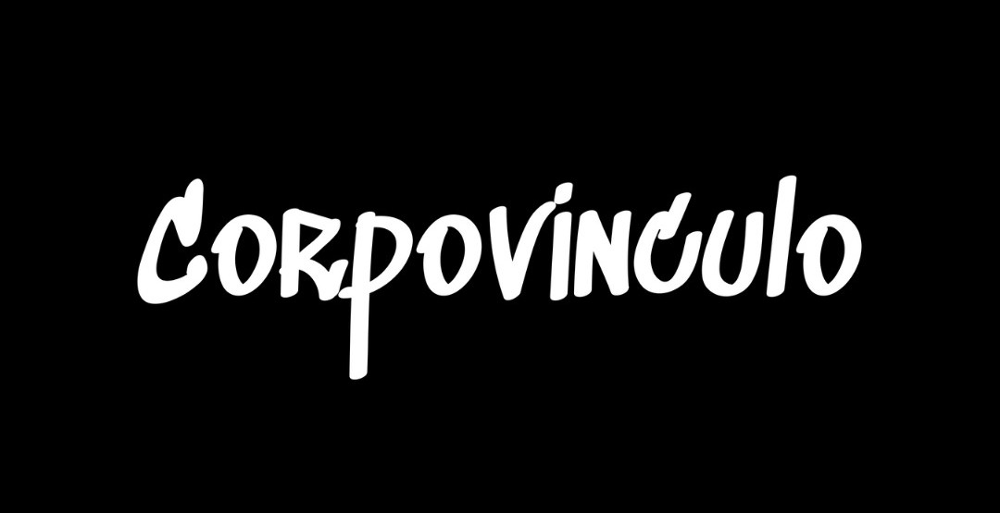

  

-----

<h1 align="center"> CorpoVinculo </h1>

This repository holds the entire application stack for **CorpoVinculo**, also branded as **IndustryConnect**. This platform is a centralized, role-based system designed to streamline sponsorship management and industry outreach for IEEE student branches and sub-clubs. 

-----

## 1\. Project Overview

### The Problem

IEEE student branches face major inefficiencies, relying on fragmented tools (Google Sheets, Excel), leading to **duplicate outreach**, **poor coordination**, time-consuming manual communication, and a **lack of volunteer accountability**.

### The Solution

CorpoVinculo provides a single source of truth for all outreach activities.  

  * **Centralized Company Tracker:** A unified database of company contacts accessible across all sub-clubs.
  * **Role-Based Access Control (RBAC):** Secure access based on roles (Chairperson, IO Lead, Volunteer, etc.).
  * **AI-Powered Generator:** Creates standardized, professional proposals and outreach emails.
  * **Automated Reminders:** System to track follow-ups and pending company responses.
  * **Volunteer Dashboard:** Tracks and monitors individual contributions and activity.

-----

## 🛠️ Tech Stack

  
  
  
  
  

